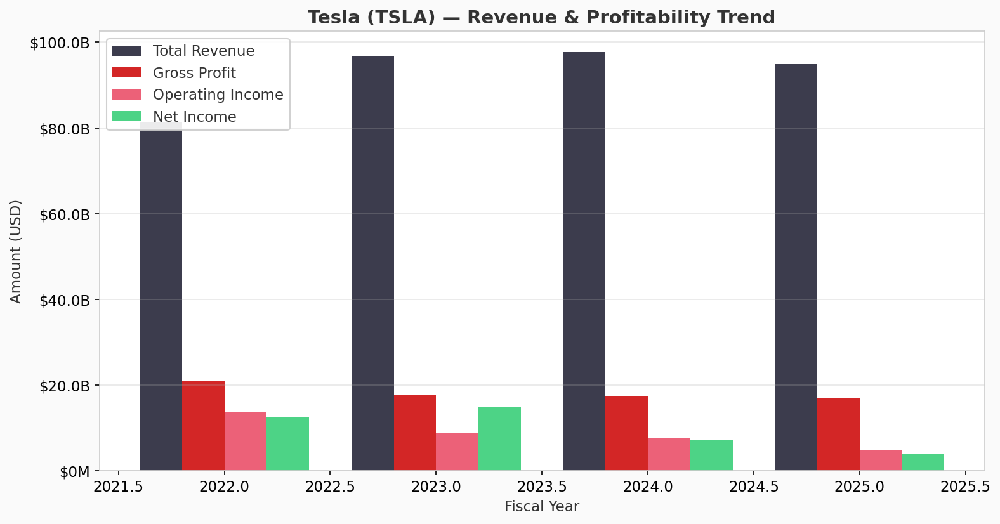

# Tesla (TSLA) Financial Analysis Project

A comprehensive financial analysis framework built with Python, using real Tesla data from Yahoo Finance. Designed as a portfolio project for LinkedIn showcasing skills in **budgeting**, **forecasting**, **P&L analysis**, and **sensitivity analysis**.



---

## What This Project Covers

| Module | Description |
|--------|-------------|
| **P&L Analysis** | Revenue, margins, YoY growth, expense breakdown |
| **Budgeting** | Forward budget from historical trends + variance analysis |
| **Forecasting** | Time-series forecasts with bull/base/bear scenarios |
| **Sensitivity** | One-way, two-way tables, tornado charts |

## Tech Stack

- **Python 3.10+** — Data pipeline & analysis
- **Next.js 15 + React** — Interactive web dashboard
- **yfinance** — Yahoo Finance data API
- **pandas / numpy** — Data processing
- **statsmodels** — Exponential smoothing forecasts
- **Recharts** — Interactive charts in the browser
- **Tailwind CSS** — UI styling
- **Vercel** — Static site hosting

## Quick Start

### Python Analysis

```bash
pip install -r requirements.txt
python main.py
```

### Web Dashboard (local)

```bash
# 1. Export latest data for the web app
python scripts/export_for_web.py

# 2. Run the Next.js dev server (requires Node.js 18+)
cd web
npm install
npm run dev
```

Open [http://localhost:3000](http://localhost:3000)

### Deploy to Vercel

See [web/DEPLOY.md](web/DEPLOY.md) for full instructions.

1. Push repo to GitHub
2. Import on [vercel.com](https://vercel.com) with **Root Directory** = `web`
3. Deploy — live dashboard in ~1 minute

Outputs are saved to:
- `outputs/charts/` — 9 publication-ready charts
- `outputs/reports/` — CSV reports + executive summary
- `outputs/data/` — Raw financial data from Yahoo Finance

## Project Structure

```
├── main.py                  # Run the full analysis pipeline
├── scripts/
│   └── export_for_web.py    # Export JSON + charts for web dashboard
├── web/                     # Next.js dashboard (deploy to Vercel)
│   ├── app/                 # Pages & layout
│   ├── components/          # Charts, UI, layout
│   ├── data/analysis.json   # Bundled analysis data
│   ├── public/charts/       # Chart images
│   └── DEPLOY.md            # Vercel deployment guide
├── requirements.txt
├── src/
│   ├── data_fetcher.py      # Yahoo Finance data retrieval
│   ├── pl_analysis.py       # P&L & margin analysis
│   ├── budgeting.py         # Budget planning & variance
│   ├── forecasting.py       # Revenue/earnings forecasts
│   ├── sensitivity.py       # Sensitivity & scenario tables
│   └── visualization.py     # Chart generation
├── notebooks/
│   └── tesla_analysis.ipynb # Interactive walkthrough
└── outputs/
    ├── charts/              # Generated visualizations
    ├── reports/             # CSV + executive summary
    └── data/                # Raw downloaded data
```

## Sample Insights (Tesla)

After running the pipeline, you'll get insights like:

- **Revenue & profitability trends** across 5 fiscal years
- **Margin analysis** — gross, operating, and net margins over time
- **Budget vs actual variance** — did Tesla beat or miss projections?
- **3-year revenue forecast** with scenario modeling (bear/base/bull)
- **Sensitivity tornado chart** — which drivers impact net income most?

## Key Charts Generated

| # | Chart | Purpose |
|---|-------|---------|
| 01 | Revenue & Profit Trend | Historical performance overview |
| 02 | Margin Trends | Profitability efficiency |
| 03 | YoY Growth | Growth rate analysis |
| 04 | Stock Price (5Y) | Market context |
| 05 | Budget vs Actual | Planning accuracy |
| 06 | Revenue Forecast | Forward projection |
| 07 | Scenario Analysis | Bull/base/bear cases |
| 08 | Tornado Chart | Driver sensitivity ranking |
| 09 | Sensitivity Heatmap | Two-way driver interaction |

## Customization

Change the ticker symbol to analyze any public company:

```python
from main import run_analysis
run_analysis(ticker="AAPL")  # Apple
run_analysis(ticker="MSFT")  # Microsoft
```

Adjust growth assumptions in `main.py`:

```python
budget = budget_analyzer.create_budget(
    base_year=2023,
    growth_assumptions={"Total Revenue": 0.15, "Operating Expense": 0.10},
    years_forward=3,
)
```

## LinkedIn Post Template

> Just completed a **Financial Analysis Project** using Python and real Tesla (TSLA) data from Yahoo Finance.
>
> Built a modular framework covering:
> - P&L analysis with margin trends and YoY growth
> - Budget planning with variance analysis
> - Revenue forecasting (exponential smoothing + scenarios)
> - Sensitivity analysis with tornado charts
>
> Tech: Python | pandas | yfinance | statsmodels | matplotlib
>
> This project demonstrates end-to-end financial modeling skills — from data extraction to actionable insights.
>
> #FinancialAnalysis #Python #DataAnalytics #Tesla #FP&A

## Disclaimer

This project is for educational and portfolio purposes only. It does not constitute financial advice. Data is sourced from Yahoo Finance and may not reflect the most current filings.

## License

MIT
